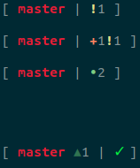

On your .bashrc (or .zshrc), put this lines :

    source ~/.git_prompt_maker.sh

    NONE="\[\033[0m\]"
    orange="\[\033[38;2;242;114;66m\]"

    PS1="$orange\u${NONE}@$orange\h$

The symbols are :

 * ✔ - when the repo is clean
 * •n - when there are n staged files
 * ✚n - when there are n changed but unstaged files
 * ✖n - when there are n files with merge conflicts
 * !n - when there are n untracked files
 * $n - when there are n stashed files
 * ▴n - when your current branch is ahead of remote by n commits
 * ▾n - when your current branch is behind remote by n commits
